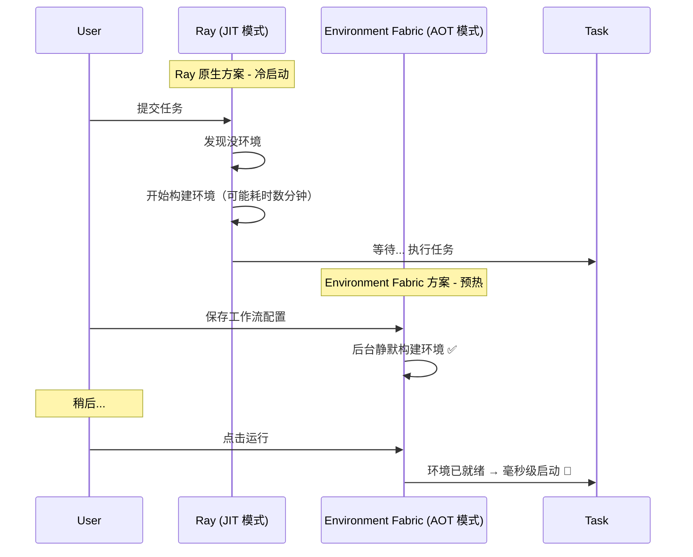

# Environment Fabric

> **Ray 的环境供应插件** — 基于 UV + NAS + Hardlink 的 AOT 预构建虚拟环境管理服务

---

## 🎯 项目定位

**Environment Fabric 不是 Ray 的替代品，而是 Ray 的「环境供应插件」。**

```
┌─────────────────────────────────────────────────────────────────────────────────┐
│                           系统架构定位                                           │
├─────────────────────────────────────────────────────────────────────────────────┤
│                                                                                 │
│  ┌──────────────────────────────┐         ┌───────────────────────────────────┐ │
│  │     Environment Fabric       │   API   │      Execution Engine             │ │
│  │     ────────────────────     │ ──────► │      ───────────────────          │ │
│  │     • AOT 预构建环境          │         │      • Ray                        │ │
│  │     • NAS 共享存储 + Hardlink │   输出   │      • Celery                     │ │
│  │     • pyproject.toml + uv.lock│  路径   │      • Kubernetes Job             │ │
│  │     • 环境生命周期管理         │         │      • Docker / subprocess        │ │
│  └──────────────────────────────┘         └───────────────────────────────────┘ │
│                                                                                 │
│  产出：标准的 .venv 路径（如 /mnt/nas/envs/wf-001/node-A/.venv/bin/python）      │
│  消费者：任何能使用 Python 解释器路径的执行引擎                                    │
│                                                                                 │
└─────────────────────────────────────────────────────────────────────────────────┘
```

---

## 🔌 与 Ray 的融合方案：`py_executable`

利用 Ray 的 `py_executable` 参数（实验性功能），可以让 Ray Worker 直接使用 Environment Fabric 预构建的 Python 环境：

```python
import ray

# 1. Environment Fabric 预先构建的环境路径（位于 NAS 共享存储）
#    所有 Ray Worker 节点通过 NFS 挂载同一路径
PREBUILT_PYTHON = "/mnt/nas/envs/workflow-001/node-A/.venv/bin/python"

# 2. 定义 runtime_env，告诉 Ray："别自己装包了，直接用我给你的这个 Python"
runtime_env = {
    "py_executable": PREBUILT_PYTHON,  # 关键：指定 Worker 启动时使用的解释器
    "working_dir": "./my_project_code"  # 仍可挂载代码目录
}

@ray.remote(runtime_env=runtime_env)
def heavy_computing_task():
    import sys
    import torch
    # 这里使用的是 Environment Fabric 预构建的环境
    return f"Running on {sys.executable} with torch {torch.__version__}"

# 3. 执行
ray.init()
print(ray.get(heavy_computing_task.remote()))
```

> [!TIP]
> **融合架构的核心思想**
> 
> - **Environment Fabric**：负责 AOT 预构建环境，产出 `.venv` 路径
> - **Ray**：负责 JIT 任务调度，通过 `py_executable` 使用预构建环境
> - **结果**：环境构建与任务执行解耦，两者各司其职

---

## 🚀 为什么需要 Environment Fabric？

Ray 的 `runtime_env` 虽然强大，但它本质上是 **"分布式的、节点本地的、JIT 的"**。
而 Environment Fabric 是 **"中心化的、全局共享的、AOT 的"**。

以下 4 个生产级场景，Ray 原生方案解决不了，而 Environment Fabric 是完美解法：

### 场景一：大规模 SaaS 平台（10000+ 环境）

> **问题**：磁盘成本爆炸

| 架构 | 10 台机器 × 安装 torch (2GB) | 总磁盘占用 |
|------|------------------------------|-----------|
| Ray Runtime Env (Node-local) | 每台机器独立安装 | **20 GB** |
| Environment Fabric (NAS + Hardlink) | 共享存储 + 硬链接 | **2 GB** |

**Environment Fabric 方案**：
- 所有环境构建在 NAS 共享存储上
- 利用 `uv` 的 Hardlink 机制，相同包只占用一份物理空间
- **节省 90% 以上存储成本**

```
NAS 共享存储架构：
┌─────────────────────────────────────────────────────────────────────┐
│  /mnt/nas/                        <- NFS/EFS 挂载点                 │
│    │                                                                │
│    ├── envs/                      <- 所有环境                       │
│    │   ├── wf-001_node-A/.venv/   <- 环境A (torch)                 │
│    │   ├── wf-001_node-B/.venv/   <- 环境B (torch)  ──┐            │
│    │   └── wf-002_node-C/.venv/   <- 环境C (torch)  ──┼─ Hardlink  │
│    │                                                  │             │
│    └── uv_cache/                  <- 全局缓存 ────────┘             │
│        └── torch-2.0.0.whl        <- 物理文件只存一份               │
└─────────────────────────────────────────────────────────────────────┘
```

---

### 场景二：生产环境零冷启动

> **问题**：Ray JIT 导致任务冷启动不可控



**Environment Fabric 方案**：
- **AOT 预构建**：用户编辑完工作流 → 保存 → 后台静默构建环境
- **毫秒级启动**：运行时环境已就绪，Ray 直接使用 `py_executable`
- **解耦构建与执行**：环境构建作为独立环节，不阻塞任务调度

---

### 场景三：可调试的白盒环境

> **问题**：Ray 环境是黑盒，故障难排查

| 维度 | Ray Runtime Env | Environment Fabric |
|------|-----------------|-------------------|
| 环境位置 | 临时目录，被 GC 后消失 | 持久化物理路径 |
| 故障排查 | 只能看 Ray 日志 | 可 SSH 进去 `source .venv/bin/activate` |
| 环境回滚 | 不支持 | 可对环境做 Snapshot |
| 确定性 | pip list 松散 | `uv.lock` 字节级锁定 |

**Environment Fabric 方案**：
- 环境是物理存在的文件夹，可随时进入排查
- `pyproject.toml` + `uv.lock` 保证环境字节级一致
- 支持环境版本管理和回滚

---

### 场景四：Vendor Agnostic（不锁定执行引擎）

> **问题**：Ray `runtime_env` 与 Ray 强绑定

**Environment Fabric 方案**：
- 产出标准的 `.venv` 路径
- 可被任何执行引擎消费

```python
# 被 Ray 消费
@ray.remote(runtime_env={"py_executable": venv_python_path})
def ray_task(): ...

# 被 Docker 挂载
# docker run -v /mnt/nas/envs:/envs python:3.11 /envs/wf-001/.venv/bin/python script.py

# 被 Kubernetes Job 使用
# command: ["/mnt/nas/envs/wf-001/node-A/.venv/bin/python", "main.py"]

# 被 subprocess 调用
subprocess.run([venv_python_path, "script.py"])
```

---

## 📊 技术对比总结

| 维度 | Environment Fabric | Ray Runtime Env |
|------|-------------------|-----------------|
| **构建时机** | ⏱️ AOT (提前构建) | ⏳ JIT (运行时构建) |
| **存储模型** | 💾 NAS 共享 + Hardlink | 📦 Node-local 缓存 |
| **环境确定性** | 🔒 `uv.lock` 字节级锁定 | 🎲 `pip list` 松散声明 |
| **冷启动时间** | 🚀 毫秒级 | 🐢 分钟级（大依赖） |
| **可调试性** | ✅ 持久化白盒 | ❌ 临时黑盒 |
| **耦合度** | 🔌 Vendor Agnostic | 🔗 Ray 强绑定 |
| **磁盘效率** | 💰 节省 90%+ | 📈 线性增长 |

---

## 🏗️ NAS 共享存储架构

> [!IMPORTANT]
> **硬性部署条件**
> 
> `UV_CACHE_DIR` 必须与 `ENVS_BASE_PATH` 在同一物理分区（NAS 挂载点），才能使用 Hardlink 机制。

```
/mnt/nas/                           <- NFS/EFS 挂载点（所有节点共享）
│
├── envs/                           <- ENVS_BASE_PATH
│   ├── workflow123_node123/        <- 独立 UV 项目
│   │   ├── .venv/                  <- 虚拟环境
│   │   │   └── bin/python          <- Ray py_executable 指向这里
│   │   ├── pyproject.toml          <- 依赖声明
│   │   ├── uv.lock                 <- 版本锁定
│   │   └── metadata.json           <- 环境元数据
│   └── ...
│
└── uv_cache/                       <- UV_CACHE_DIR（全局共享缓存）
    ├── wheels/                     <- .whl 包文件
    └── archives/                   <- 源码包
            ↑
            └── Hardlink 指向各环境的 .venv/lib/
```

---

## 📁 详细技术文档

技术细节已拆分到独立文档：

| 文档 | 描述 |
|------|------|
| [📋 PRD - 产品需求文档](docs/PRD.md) | 背景、目标、功能范围 |
| [🏛️ ARD - 架构需求文档](docs/ARD.md) | 系统架构、组件设计、存储策略 |
| [⚙️ TRD - 技术需求文档](docs/TRD.md) | API 规范、项目结构、配置说明 |

---

## 🚀 快速开始

### 1. 环境要求

- Python 3.11+
- [uv](https://github.com/astral-sh/uv) 包管理器
- NAS/共享存储（生产环境）
- PostgreSQL（审计数据库）

### 2. 安装与运行

```bash
# 克隆项目
git clone <repo-url>
cd env_manager

# 安装依赖
uv sync

# 配置环境变量
cp .env.template .env
# 编辑 .env 文件配置 DATA_ROOT、DATABASE_URL 等

# 启动服务
uv run uvicorn src.api:app --host 0.0.0.0 --port 8000
```

### 3. 创建环境

```bash
# 创建一个新环境
curl -X POST http://localhost:8000/envs \
  -F "workflow_id=wf-001" \
  -F "node_id=node-A" \
  -F "packages=numpy>=1.24.0" \
  -F "packages=pandas>=2.0.0"
```

### 4. 与 Ray 集成

```python
import ray
import httpx

# 1. 从 Environment Fabric 获取预构建环境路径
resp = httpx.get("http://localhost:8000/envs/wf-001/node-A")
env_path = resp.json()["env_path"]
python_path = f"{env_path}/.venv/bin/python"

# 2. 配置 Ray 使用该环境
runtime_env = {"py_executable": python_path}

@ray.remote(runtime_env=runtime_env)
def my_task():
    import numpy as np
    return np.__version__

ray.init()
print(ray.get(my_task.remote()))
```

