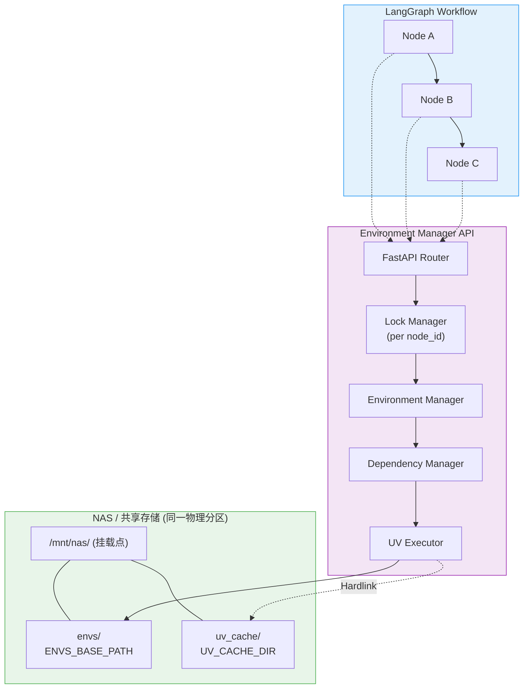
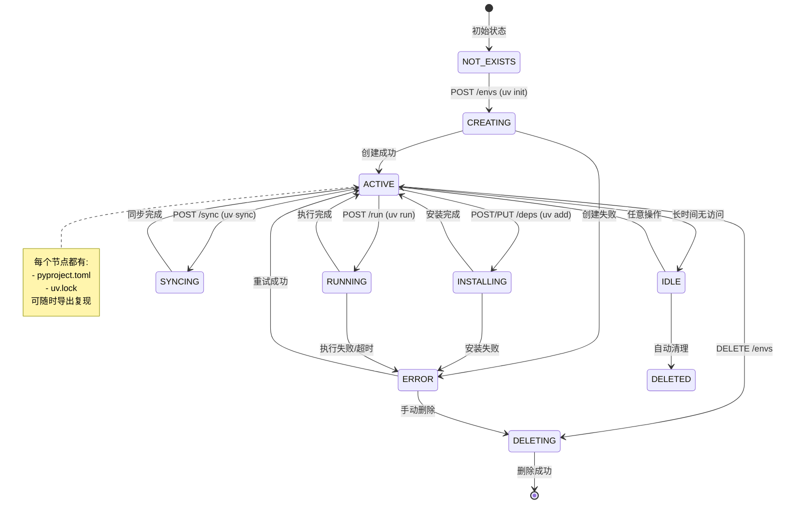
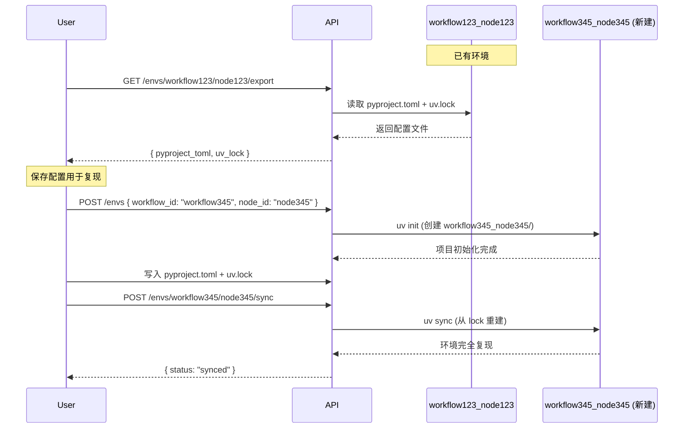

# 架构需求文档 (ARD)

> 本文档描述 Environment Fabric 的系统架构、核心组件和存储策略。

---

## 1. 系统架构

### 1.1 架构概览

```
┌─────────────────────────────────────────────────────────────────────┐
│                         LangGraph Workflow                          │
│    ┌────────┐     ┌────────┐     ┌────────┐     ┌────────┐         │
│    │ Node A │ ──▶ │ Node B │ ──▶ │ Node C │ ──▶ │ Node D │         │
│    └───┬────┘     └───┬────┘     └───┬────┘     └───┬────┘         │
└────────┼──────────────┼──────────────┼──────────────┼───────────────┘
         │              │              │              │
         ▼              ▼              ▼              ▼
┌─────────────────────────────────────────────────────────────────────┐
│                    Environment Manager API Layer                     │
│  ┌────────────────────────────────────────────────────────────────┐ │
│  │                      FastAPI Application                        │ │
│  │  POST /envs                          - 创建环境 (uv init)        │ │
│  │  GET  /envs/{workflow_id}/{node_id}  - 查询环境状态              │ │
│  │  DELETE /envs/{workflow_id}/{node_id} - 删除环境                 │ │
│  │  POST /envs/{...}/deps               - 添加依赖 (uv add)         │ │
│  │  GET  /envs/{...}/deps               - 列出依赖                  │ │
│  │  PUT  /envs/{...}/deps               - 更新依赖                  │ │
│  │  DELETE /envs/{...}/deps             - 删除依赖                  │ │
│  │  POST /envs/{...}/sync               - 同步环境 (uv sync)        │ │
│  │  GET  /envs/{...}/export             - 导出 lock 文件            │ │
│  │  POST /envs/{...}/run                - 执行代码 (uv run)         │ │
│  │  POST /envs/cleanup                  - 清理过期环境              │ │
│  └────────────────────────────────────────────────────────────────┘ │
└─────────────────────────────────────────────────────────────────────┘
                                  │
                                  ▼
┌─────────────────────────────────────────────────────────────────────┐
│                     File System Layer (NAS/共享存储)                 │
│  ┌────────────────────────────────────────────────────────────────┐ │
│  │  /mnt/nas/                    <- NFS/EFS 挂载点                 │ │
│  │    │                                                            │ │
│  │    ├── envs/                  <- ENVS_BASE_PATH                 │ │
│  │    │   ├── workflow123_nodeA/ <- 独立 UV 项目                   │ │
│  │    │   │   ├── .venv/         <- 虚拟环境                       │ │
│  │    │   │   ├── pyproject.toml <- 项目配置 + 依赖声明            │ │
│  │    │   │   ├── uv.lock        <- 精确版本锁定                   │ │
│  │    │   │   └── metadata.json  <- 环境元数据                     │ │
│  │    │   └── ...                                                  │ │
│  │    │                                                            │ │
│  │    └── uv_cache/              <- UV_CACHE_DIR (平级目录!)       │ │
│  │        ├── wheels/            <- 下载的 whl 包                  │ │
│  │        └── archives/          <- Hardlink 共享包文件            │ │
│  └────────────────────────────────────────────────────────────────┘ │
└─────────────────────────────────────────────────────────────────────┘
```



### 1.2 环境生命周期状态机



### 1.3 核心组件

| 组件 | 职责 |
|------|------|
| **LockManager** | 并发控制：每个 node_id 对应一把 asyncio.Lock |
| **EnvManager** | 环境生命周期管理（创建/删除/查询/清理） |
| **DependencyManager** | 依赖 CRUD 操作（uv add/remove/sync） |
| **UVCommandExecutor** | UV CLI 命令封装与执行（跨平台路径处理） |
| **ProjectInfo** | 主项目依赖版本映射（确保子环境兼容性） |

### 1.4 UV 命令映射

| 操作 | UV CLI 命令 | 说明 |
|------|-------------|------|
| **初始化项目** | `uv init {env_path}` | 创建 pyproject.toml |
| **添加依赖** | `uv add {packages} --project {env_path}` | 更新 pyproject.toml + uv.lock |
| **删除依赖** | `uv remove {package} --project {env_path}` | 从项目移除依赖 |
| **同步环境** | `uv sync --project {env_path}` | 从 uv.lock 重建 .venv |
| **列出依赖** | `uv tree --project {env_path}` | 查看依赖树 |
| **运行代码** | `uv run --project {env_path} python -c {code}` | 在项目环境中执行 |
| **锁定依赖** | `uv lock --project {env_path}` | 仅更新 uv.lock |

> [!TIP]
> **为什么使用 `uv add` 而非 `uv pip install`？**
> 
> | 特性 | `uv pip install` | `uv add` |
> |------|-----------------|----------|
> | 生成 pyproject.toml | ❌ | ✅ |
> | 生成 uv.lock | ❌ | ✅ |
> | 环境可复现 | ❌ | ✅ |
> | 依赖解析一致性 | 弱 | 强 |

### 1.5 并发控制设计

> [!IMPORTANT]
> **必须实现的并发安全机制**

```python
import asyncio
from collections import defaultdict

class LockManager:
    """每个 node_id 对应一把 asyncio.Lock"""
    
    def __init__(self):
        self._locks: dict[str, asyncio.Lock] = defaultdict(asyncio.Lock)
    
    def get_lock(self, node_id: str) -> asyncio.Lock:
        return self._locks[node_id]
    
    async def cleanup_lock(self, node_id: str):
        """环境删除后清理锁"""
        self._locks.pop(node_id, None)
```

### 1.6 依赖版本继承机制

为了确保节点环境与主项目（Host）的依赖版本兼容，系统引入了依赖映射机制：

1. **自动探测**: 系统启动时读取主项目的 `pyproject.toml`。
2. **版本注入**: 当用户请求安装依赖（如 `fastapi`）未指定版本时，系统会自动注入主项目的版本约束。
3. **一致性**: 保证所有节点环境的基础依赖版本不低于主项目要求。

---

## 2. 存储策略

### 2.1 每个节点的目录结构

```
envs/workflow123_node123_v1/  # 格式: {workflow_id}_{node_id}_{version_id}
├── .venv/                  # UV 自动管理的虚拟环境
├── pyproject.toml          # 项目配置 + 依赖声明
├── uv.lock                 # 精确版本锁定（可复现）
└── metadata.json           # 环境元数据
```

> [!NOTE]
> 文件夹命名格式：`{workflow_id}_{node_id}[_{version_id}]`。`version_id` 为可选参数。

### 2.2 pyproject.toml 示例

```toml
[project]
name = "node-abc"
version = "0.1.0"
requires-python = ">=3.11"
dependencies = [
    "numpy>=1.24.0",
    "pandas>=2.0.0",
    "requests",
]

[tool.uv]
# UV 特定配置
```

### 2.3 为什么依赖信息从 pyproject.toml 读取

| 方案 | 优点 | 缺点 |
|------|------|------|
| SQLite | 查询快 | 与实际环境不同步风险 |
| **pyproject.toml** | 始终与环境一致 | 需要解析 TOML |

---

## 3. 磁盘优化：Hardlink 机制

> [!IMPORTANT]
> **硬性物理条件**
> 
> `UV_CACHE_DIR` 必须与 `ENVS_BASE_PATH` 在同一物理分区/卷，且为平级目录，否则无法使用 Hardlink。

### 3.1 目录结构规范

```
/mnt/nas/                         <- NFS/EFS 挂载点
│
├── envs/                         <- ENVS_BASE_PATH
│   ├── workflow123_node123/      <- 命名格式: workflow_id_node_id
│   │   ├── .venv/
│   │   ├── pyproject.toml
│   │   └── uv.lock
│   └── workflow345_node345/
│       ├── .venv/
│       ├── pyproject.toml
│       └── uv.lock
│
└── uv_cache/                     <- UV_CACHE_DIR (全局共享缓存)
    ├── wheels/
    └── archives/
```

### 3.2 磁盘空间节省示例

| 场景 | 无 Hardlink | 有 Hardlink |
|------|-------------|-------------|
| 10 个节点都安装 numpy (50MB) | 500 MB | **50 MB** |
| 10 个节点都安装 torch (2GB) | 20 GB | **2 GB** |

---

## 4. 环境复现流程


